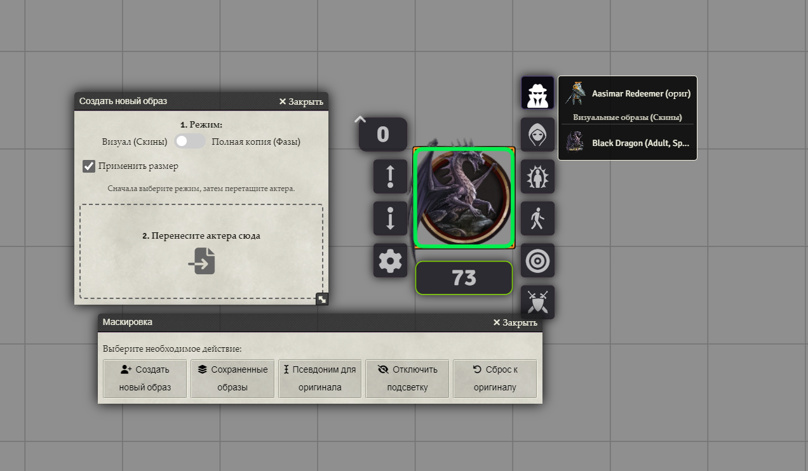
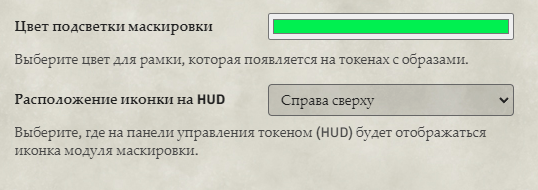

# Pathfinder 2E: Token Pack by Metofay

[](https://github.com/Metofay/pf2e-token-pack/releases/latest)

[](https://boosty.to/metofay)
[](https://github.com/Metofay/pf2e-token-pack/blob/master/README.md)


## 🐲 About the Module

This module for **Foundry VTT** adds a large collection of tokens and art for the **Pathfinder 2e** system, and also provides tools to manage your content.

## ⚙️ Module Features

In addition to simply adding content, the module offers several powerful tools:

### 1. Compendium Settings
Allows you to check paths for art and tokens, delete unnecessary files, view the number of missing actors, and disable loading of unneeded compendiums.


### 2. Actor Restoration
Restores actors in the sidebar and on the scene to their appearance in the compendium. You can configure exceptions by actor type and folder.


### 3. NPC Disguise
Allows you to change an actor's appearance, create "phases" (completely separate, editable character sheets), and easily switch between them or revert to the original appearance.


Now with additional functionality:
1. Quick access for changing appearances.
2. Option to apply size when creating an appearance.
3. Works for both NPCs and other actor types (Visual only).
4. Token highlighting if it has alternate appearances (visible only to GM), with an option to disable highlighting for the token.
5. You can now control the token highlight color in the settings.
6. You can change the name of the original appearance.
7. Setting for the location of the HUD element on the token.
8. Players can change their own disguises.
9. Choosing the type of token outline with images



### 4. Character Gallery
Adds a new feature: a large, fully localized "Character Gallery" art library for images not found in the standard compendiums.
Requires the installation of the additional module [**Pathfinder 2E: Token Pack (Character Gallery)**](https://github.com/Metofay/pf2e-token-pack-character-gallery). This add-on module can work both separately and in conjunction with the main one. In the future, art from the compendium will be added, and the Character Gallery will become dependent on the main module.


## 📥 Installation

1.  In the Foundry VTT Setup screen, go to the **Add-on Modules** tab.
2.  Click **"Install Module"**.
3.  In the "Manifest URL" field, paste the following link:
    ```
    https://raw.githubusercontent.com/Metofay/pf2e-token-pack//main/module.json
    ```
4.  Click **"Install"** and wait for the installation to complete.
5.  Activate the module in your game world's settings.

## 📚 Content Coverage

* ✅ - Dynamic tokens are available.
* ❌ - Missing art (quantity noted).

### Bestiary

| Source | Status |
| :--- | :---: |
| Bestiary 1 | ✅ |
| Bestiary 2 | ✅ |
| Bestiary 3 | ✅ |
| Monster Core | ✅ |
| NPC Core | ✅ |

### Adventure Paths

| Source | Status | Notes |
| :--- | :---: | :--- |
| Abomination Vaults | ✅ | |
| Age of Ashes | ✅❌ | 1 art missing |
| Agents of Edgewatch | ✅❌ | 6 arts missing |
| Blood Lords | ✅❌ | 2 arts missing |
| Curtain Call | ✅ | |
| Extinction Curse | ✅❌ | 8 arts missing |
| Fist of the Ruby Phoenix | ✅ | |
| Gatewalkers | ✅❌ | 1 art missing |
| Outlaws of Alkenstar | ✅ | |
| Kingmaker | ✅ | |
| Quest for the Frozen | ✅ | |
| Season of Ghosts | ✅ | |
| Seven Dooms for Sandpoint | ✅ | |
| Sky King's Tomb | ✅❌ | 2 arts missing |
| Spore War | ✅ | |
| Strength of Thousands | ✅❌ | 14 arts missing |
| Triumph of the Tusk | ✅❌ | 10 arts missing |
| Shades of Blood | ✅ |  |
| Stolen Fate | ✅ | |
| Wardens of Wildwood | ✅❌ | 1 art missing |

### Rulebooks

| Source | Status | Notes |
| :--- | :---: | :--- |
| Book of the Dead | | |
| Paizo Blog | ❌ | 3 arts missing |
| Howl of the Wild | ❌ | 16 arts missing |
| Lost Omens Bestiary | ✅❌ | 22 arts missing |
| NPC Gallery | ❌ | 3 arts missing |
| Dark Archive | ❌ | 1 art missing |
| Rage of Elements | ❌ | 17 arts missing |
| War of Immortals | | |

### Adventures

| Source | Status | Notes |
| :--- | :---: | :--- |
| Claws of the Tyrant | ❌ | 11 arts missing |
| Fall of Plaguestone | ❌ | 1 art missing |
| Malevolence | ❌ | 3 arts missing |
| Menace Under Otari | | |
| One-Shots | ❌ | 9 arts missing |
| Prey for Death | | |
| Rusthenge | | |
| Shadows at Sundown | | |
| The Enmity Cycle | | |
| The Slithering | | |
| Troubles in Otari | | |
| Night of the Gray Death | ❌ | 3 arts missing |
| Crown of the Kobold King | ❌ | 2 arts missing |

### Pathfinder Society

| Source | Status | Notes |
| :--- | :---: | :--- |
| Intro | ✅ | |
| Season 1 | ✅❌ | 67 arts missing |

### Pregenerated PCs

| Source | Status |
| :--- | :---: |
| Adventure Pregens | ✅ |

---

## ❤️ Support the Author

If you enjoy my work, you can support me on Boosty. It's a great motivation for the module's continued development!

[](https://boosty.to/metofay)
