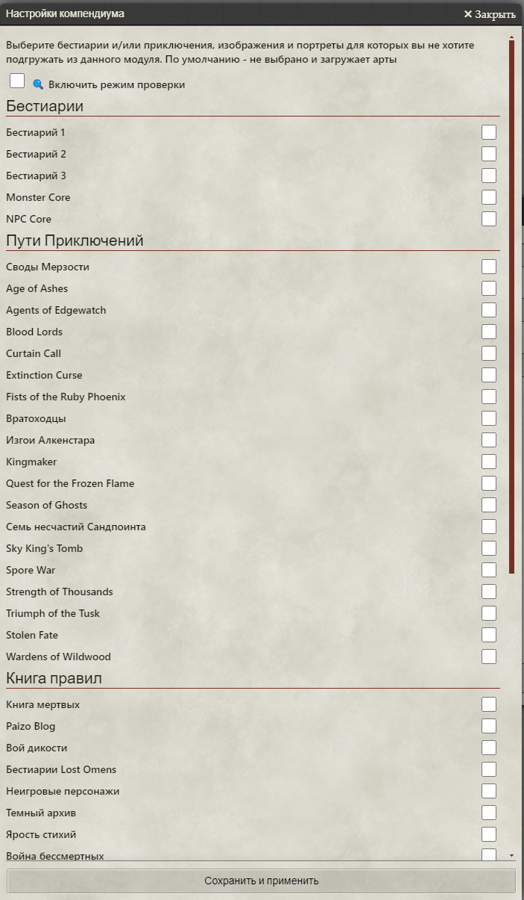
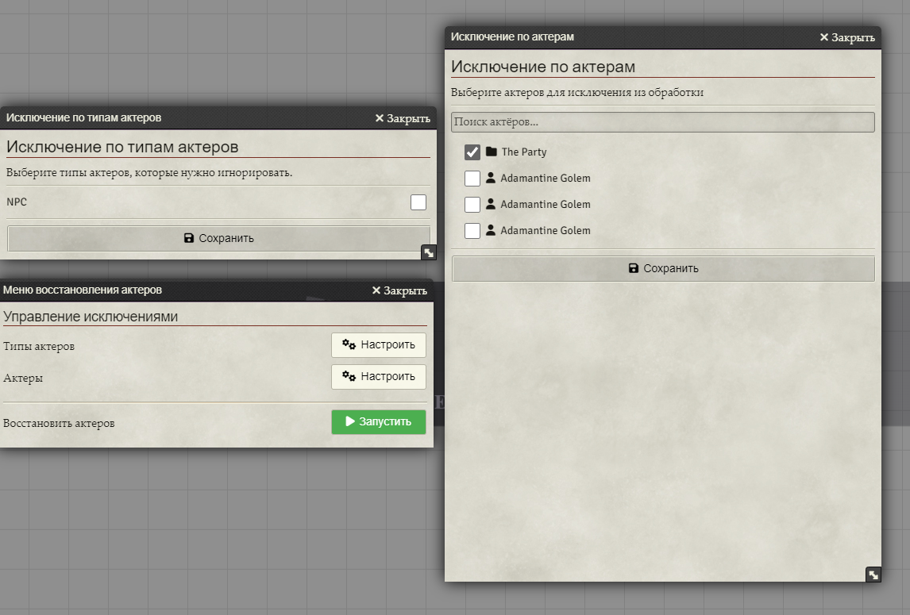
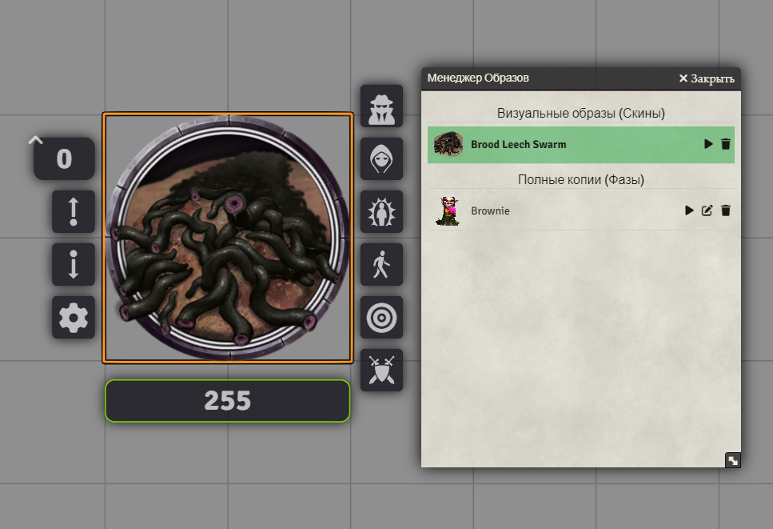

# Pathfinder 2E: Token Pack от Metofay

[](https://github.com/Metofay/pf2e-token-pack/releases/latest)

[](https://boosty.to/metofay)
[](https://github.com/Metofay/pf2e-token-pack/blob/master/README-en.md)


## 🐲 О модуле

Этот модуль для **Foundry VTT** добавляет в систему **Pathfinder 2e** большую коллекцию токенов и артов, а также предоставляет инструменты для управления вашим контентом.

## ⚙️ Функционал модуля

Помимо простого добавления контента, модуль предлагает несколько мощных инструментов:

### 1. Настройка компендиумов
Позволяет проверять пути к артам и токенам, удалять лишние файлы, видеть количество пропущенных актеров и отключать погрузку ненужных компендиумов.



### 2. Восстановление актеров
Восстанавливает актеров в боковой панели и на сцене до их вида в компендиуме. Можно настроить исключения по типам актеров и папкам.



### 3. Маскировка NPC
Позволяет менять внешность актера, создавать "фазы" (полностью отдельные изменяемые листы персонажа), а также легко переключаться между ними и возвращаться к оригинальному виду актера.



### 4. Галерея персонажей
Добавляет новую механику большой, полностью локализованной библиотеки артов "Character Gallery" для изображений, которых нет в стандартных компендиумах.
Требуется установить дополнительный модуль [**Pathfinder 2E: Token Pack (Character Gallery)**](https://github.com/Metofay/pf2e-token-pack-character-gallery). Этот дополнительный модуль работает как отдельно, так и с интеграцией в основной, в будущем будут добавлены и арты из компендиума, и Character Gallery будет зависим от основного модуля.


## 📥 Установка

1.  В меню настройки модулей Foundry VTT нажмите **"Install Module"**.
2.  В поле "Manifest URL" вставьте следующую ссылку:
    ```
    https://raw.githubusercontent.com/Metofay/pf2e-token-pack//main/module.json
    ```
3.  Нажмите **"Install"** и дождитесь окончания установки.
4.  Активируйте модуль в настройках вашего игрового мира.

## 📚 Покрытие контента

* ✅ - Есть динамические токены.
* ❌ - Есть недостающие арты (указано количество).

### Бестиарий

| Источник | Статус |
| :--- | :---: |
| Bestiary 1 | ✅ |
| Bestiary 2 | ✅ |
| Bestiary 3 | ✅ |
| Monster Core | ✅ |
| NPC Core | ✅ |

### Пути Приключений

| Источник | Статус | Примечания |
| :--- | :---: | :--- |
| Abomination Vaults | ✅ | |
| Age of Ashes | ✅❌ | Отсутствует 1 арт |
| Agents of Edgewatch | ❌ | Отсутствует 6 артов |
| Blood Lords | ✅❌ | Отсутствует 2 арта |
| Curtain Call | ✅ | |
| Extinction Curse | ❌ | Отсутствует 8 артов |
| Fist of the Ruby Phoenix | ✅ | |
| Gatewalkers | ❌ | Отсутствует 1 арт |
| Outlaws of Alkenstar | | |
| Kingmaker | ✅ | |
| Quest for the Frozen | ✅ | |
| Season of Ghosts | ✅ | |
| Seven Dooms for Sandpoint | ✅ | |
| Sky King's Tomb | ✅❌ | Отсутствует 4 арта |
| Spore War | ✅ | |
| Strength of Thousands | ❌ | Отсутствует 14 артов |
| Triumph of the Tusk | ✅❌ | Отсутствует 32 арта |
| Stolen Fate | | |
| Wardens of Wildwood | ❌ | Отсутствует 1 арт |

### Книга правил

| Источник | Статус | Примечания |
| :--- | :---: | :--- |
| Book of the Dead | | |
| Paizo Blog | ❌ | Отсутствует 3 арта |
| Howl of the Wild | ❌ | Отсутствует 16 артов |
| Lost Omens Bestiary | ✅❌ | Отсутствует 22 арта |
| NPC Gallery | ❌ | Отсутствует 3 арта |
| Dark Archive | ❌ | Отсутствует 1 арт |
| Rage of Elements | ❌ | Отсутствует 13 артов |
| War of Immortals | | |

### Приключения

| Источник | Статус | Примечания |
| :--- | :---: | :--- |
| Claws of the Tyrant | ❌ | Отсутствует 9 артов |
| Fall of Plaguestone | ❌ | Отсутствует 1 арт |
| Malevolence | ❌ | Отсутствует 3 арта |
| Menace Under Otari | | |
| One-Shots | ❌ | Отсутствует 9 артов |
| Prey for Death | | |
| Rusthenge | | |
| Shadows at Sundown | | |
| The Enmity Cycle | | |
| The Slithering | | |
| Troubles in Otari | | |
| Night of the Gray Death | ❌ | Отсутствует 3 арта |
| Crown of the Kobold King | ❌ | Отсутствует 2 арта |

### Pathfinder Society

| Источник | Статус | Примечания |
| :--- | :---: | :--- |
| Intro | ✅ | |
| Season 1 | ✅❌ | Отсутствует 67 артов |

### Pregenerated PCs

| Источник | Статус |
| :--- | :---: |
| Adventure Pregens | ✅ |

---

## ❤️ Поддержать автора

Если вам нравится моя работа, вы можете поддержать меня на Boosty. Это очень мотивирует на дальнейшее развитие модуля!

[](https://boosty.to/metofay)
